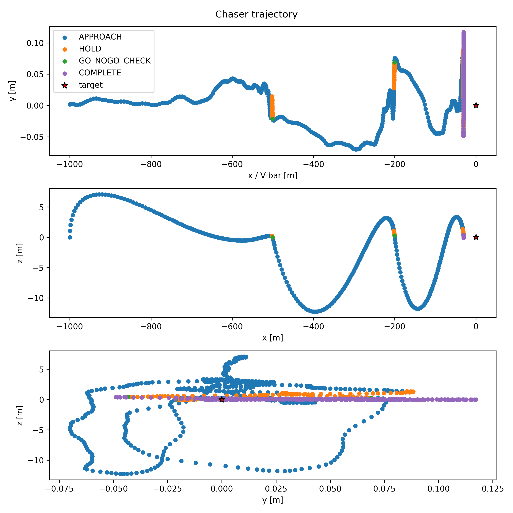
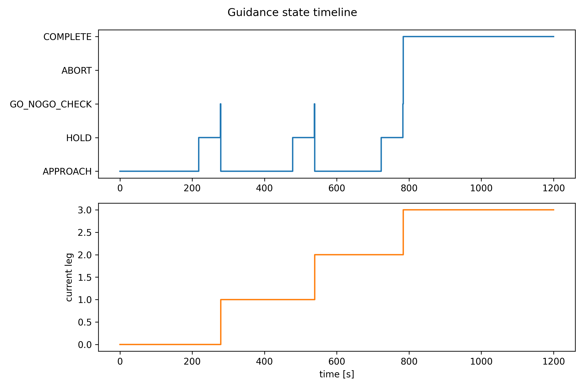
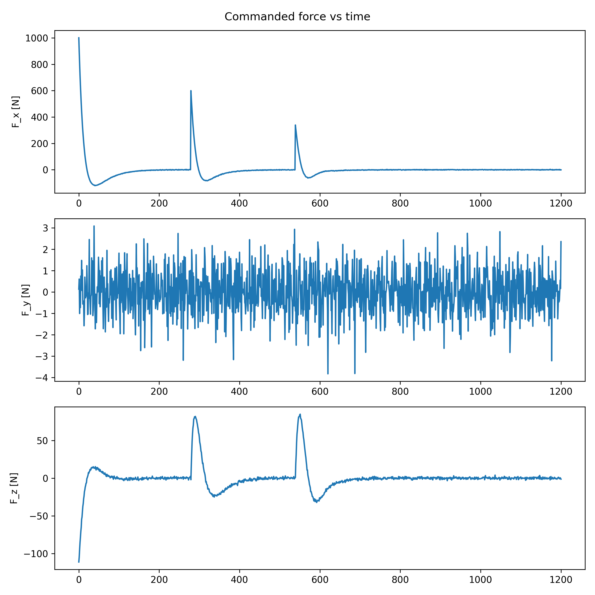
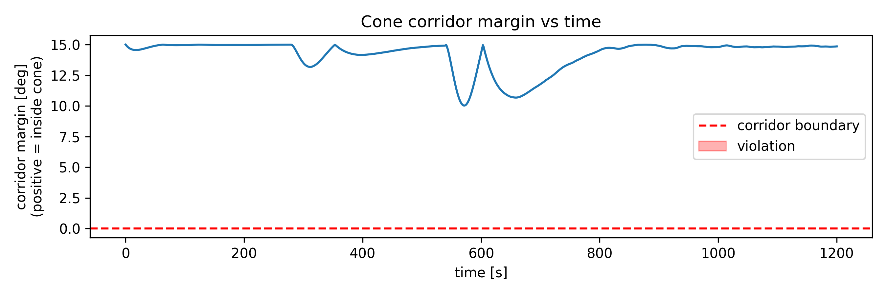
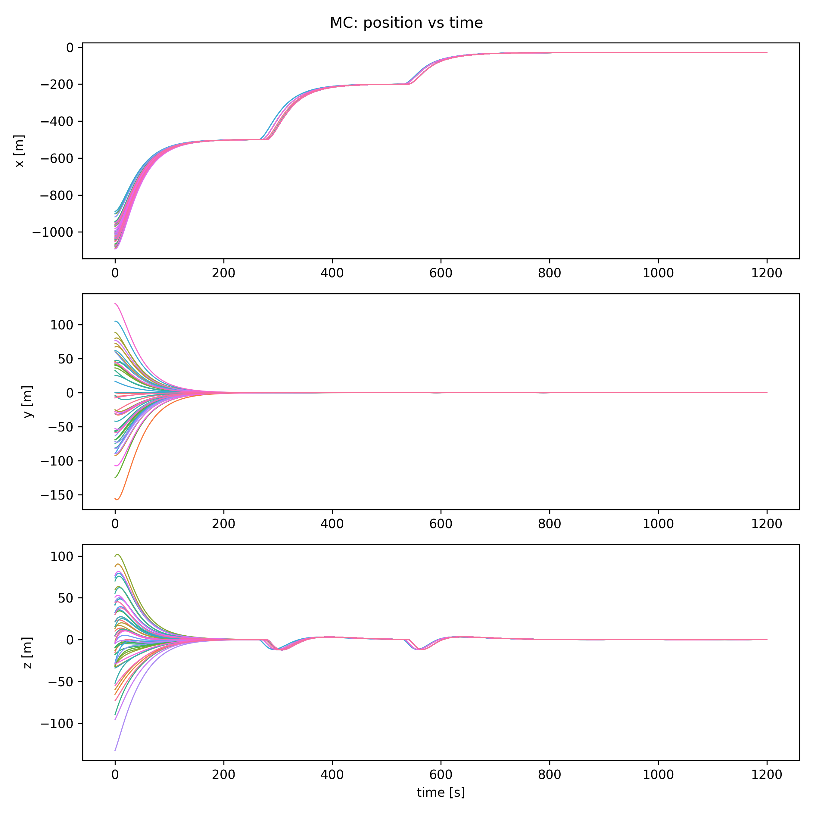
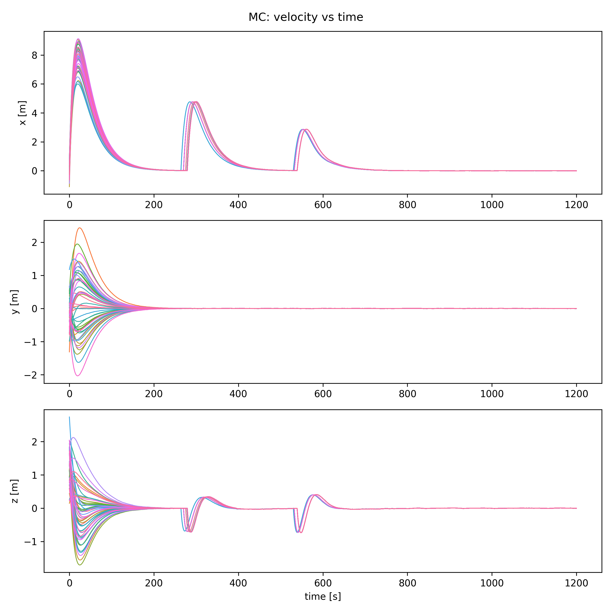
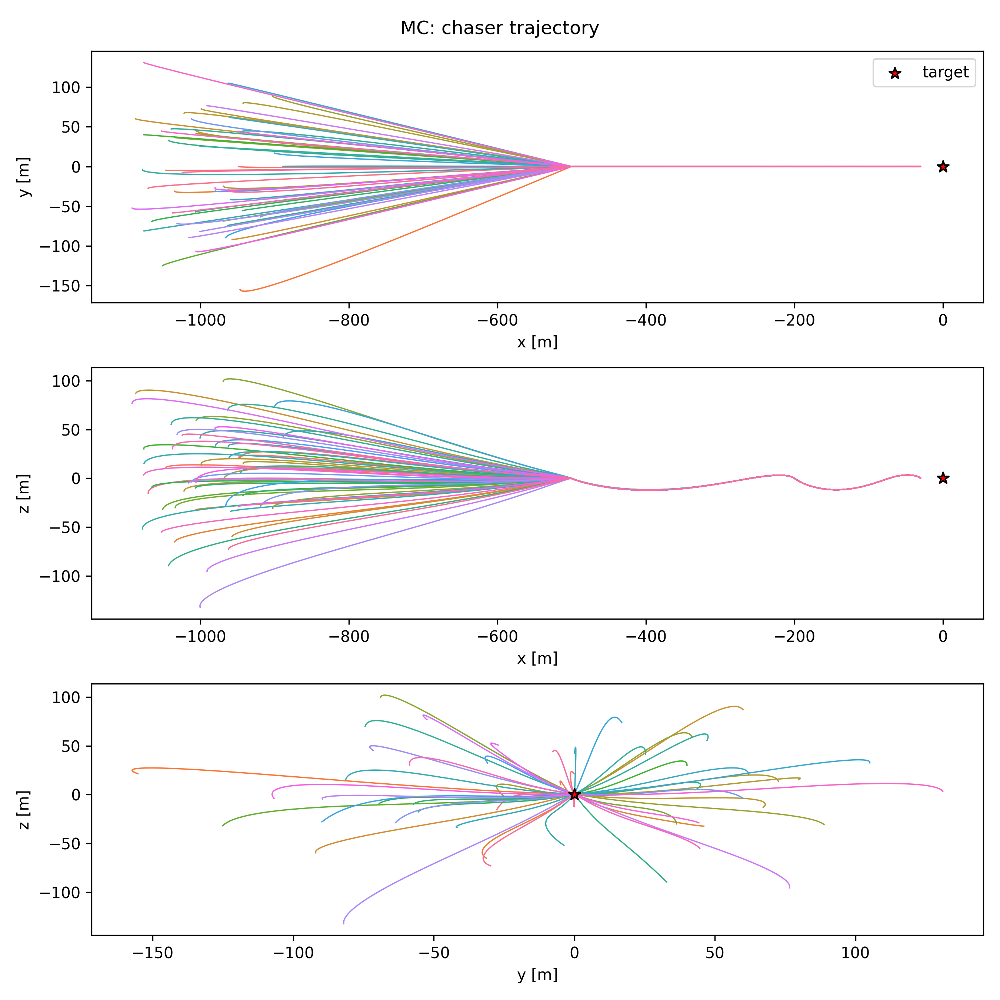
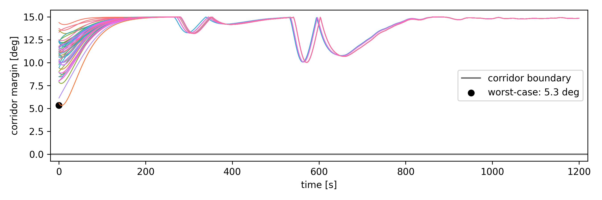
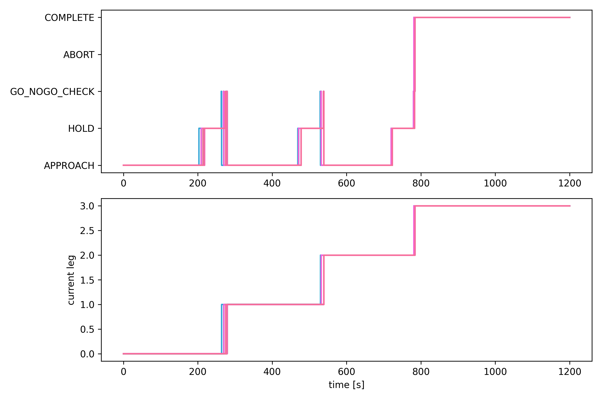

This document summarizes the verification and validation results for
a closed-loop proximity-operations GN&C simulator, built in C++ on NASA's
Trick simulation framework and the JEOD (JSC Engineering Orbital Dynamics)
dynamics library. The system under test is a flight software stack (sensor
+ guidance state machine + PD controller), against JEOD's truth propagation
for a chaser performing a V-bar approach to a target in LEO. 

Validation: 
- A single nominal trajectory is verified against expected behavior (correct     
  state-machine sequencing, and safety-margin)
- A Monte Carlo dispersion (position & velocity) campaign to assess robustness
  beyond that one trajectory
- Two main debuggings: one in the guidance logic, the other in the MC test    
  configuration itself.

### 1. Nominal run

The Trick/JEOD closed-loop GN&C stack successfully executes a full
three-leg V-bar approach. From an initial 1 km trailing offset, the
guidance state machine sequences the chaser through three hold points
(−500 m, −200 m, −30 m along V-bar), each gated by a PD-controlled
approach, a 60 s station-keeping hold, and a GO/NO-GO corridor check.
The chaser reaches the final hold point and the state changes to `COMPLETE`.

### 2. Controller and force behavior

The PD translation controller was evaluated against an arbitrary 1200 N
thruster saturation limit. Commanded force peaks once per leg (largest
on the 1st, ~1000 N, decaying to ~340 N by the 3rd, consistent with each
leg's decreasing travel distance) and decays smoothly to near-zero at
each hold point. No saturation event occurred, indicating the selected gains
(Kp = 0.01, Kd = 0.5) are suitable for the force limit for this scenario
(i.e.the controller has headroom).

### 3. Cross-axis coupling and corridor margin

Each "x" burn causes an oscillation in the "z" axis (peak ±3–12 m,
decaying smoothly over each leg), while the "y" axis shows only noise.
This coupling is expected of Clohessy-Wiltshire relative motion: radial
and along-track are coupled.

The corridor/keep-out check was validated directly against this coupling:
the cone margin (half_angle - actual_angle, positive means in the cone, no
violation) has a minimum of ~10° against the selected 15° half-angle corridor
(during the 2nd leg), recovering to ~14–15°.

** Note on axis naming:** I used x/y/z labels (x = along-track/V-bar)
rather than the traditional radial/along-track/cross-track. The underlying
coupling behavior matches CW regardless, but I might relabel during cleanup.

P.S. this margin is specific to the current hold-point spacing, corridor half-
angle, and controller gains; a tighter corridor, a closer final hold point,
or more aggressive gains will need to be re-validated.

### 4. Debugging: Corridor sign convention

Initially I computed the approach-cone angle directly from the chaser's
raw position vector sign, which produced a false ABORT at simulation start:
the chaser's trailing position (negative along-track) was misidentified as
~180° off-axis. The fix was to compute the angle relative to the direction
*from the chaser toward the target*. Confirmed fixed via end-to-end re-run
with no false aborts.

### 5. Monte Carlo dispersion & analysis
A 50-run Monte Carlo campaign dispersed the chaser's initial position and velocity (Gaussian, centered on the initial state used in `RUN_nominal`) to assess robustness beyond the single nominal trajectory validated above. Initial position was dispersed with a 50 m standard deviation per axis and initial velocity with a 0.5 m/s standard deviation per axis. 50/50 runs (100%)
reached COMPLETE. No aborts, no force saturation.

**Trajectory pattern**: all 50 dispersed starting positions (spread roughly
±100–150 m in y and z about the nominal offset) converge onto a common
trajectory within the first ~200 s. The x-position and velocity profiles
collapse to a single tight trace matching the nominal run's 3-burn shape,
while the xy and xz trajectory plots show a "fan-in pattern", indicative of
a stabilizing feedback controller

**Corridor margin**: worst-case margin across all runs was 5.3° against the
15° half-angle corridor bound (compared to ~10° for the single nominal trajectory).

**Timing convergence:** the initial position dispersion produces a 15 s spread
in arrival time at the first hold point, shrinking to 9 s by the second hold and
3 s by the third. This shows the controller converges the dispersion over the
course of the approach rather than accumulating timing variance leg over leg.

**Sensor noise:** maximum observed truth-vs-measured error across all runs was
0.37 m (position) and 0.039 m/s (velocity), both consistent with the configured 0.1 m / 0.01 m/s noise standard deviations (roughly 3.7σ and 3.9σ respectively)