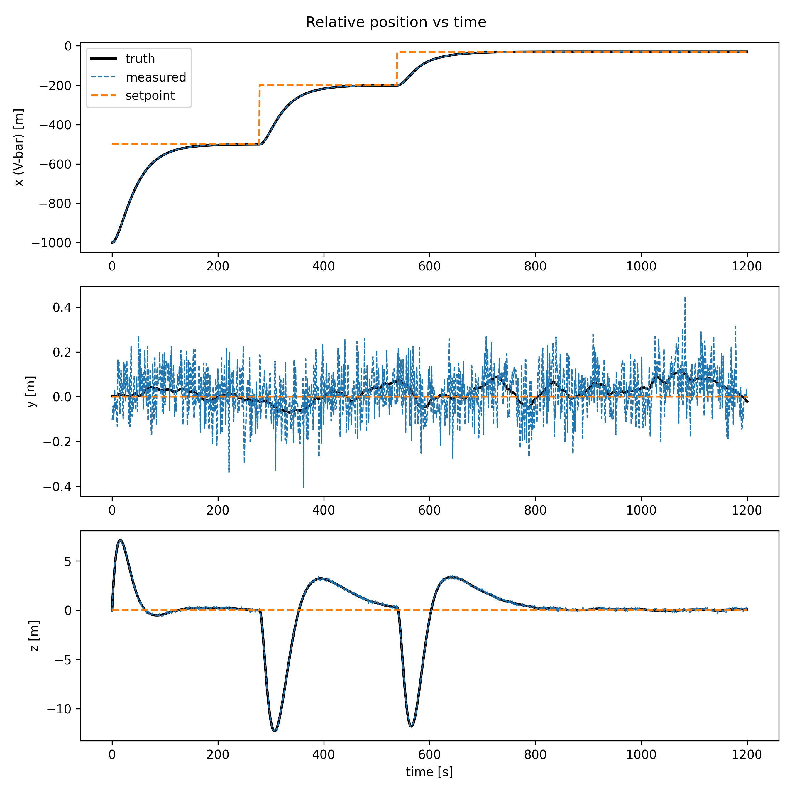
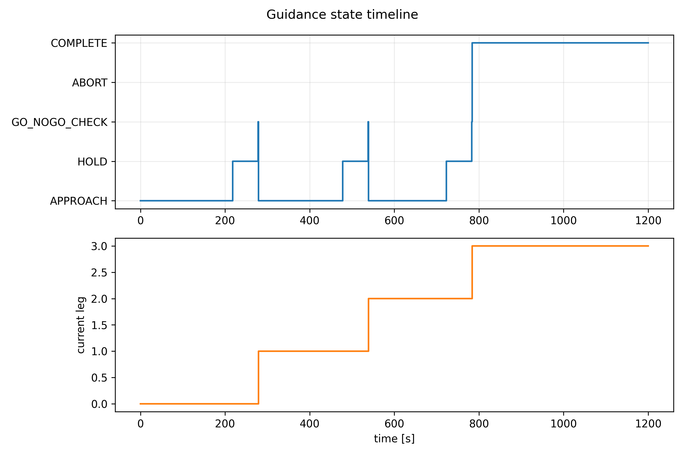
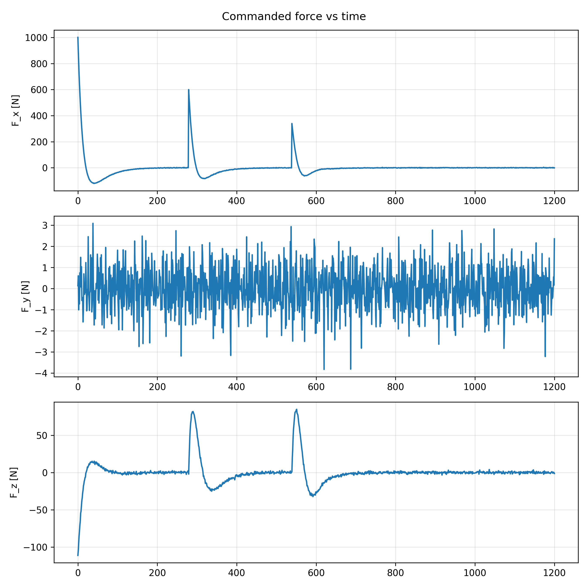
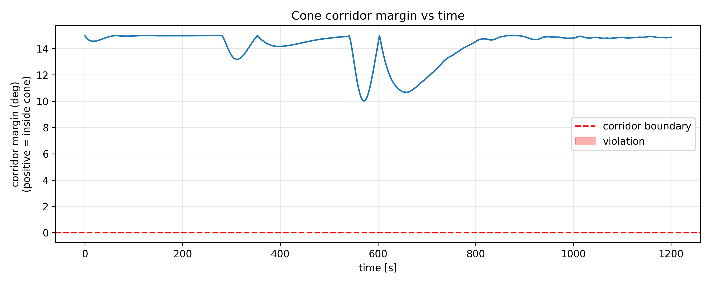

### 1. Nominal run

The Trick/JEOD closed-loop GN&C stack successfully executes a full
three-leg V-bar approach. From an initial 1 km trailing offset, the
guidance state machine sequences the chaser through three hold points
(−500 m, −200 m, −30 m along V-bar), each gated by a PD-controlled
approach, a 60 s station-keeping hold, and a GO/NO-GO corridor check.
The chaser reaches the final hold point and the state changes to `COMPLETE`.

### 2. Controller and force behavior

The PD translation controller was evaluated against an arbitrary 1200 N
thruster saturation limit. Commanded force peaks once per leg (largest
on the 1st, ~1000 N, decaying to ~340 N by the 3rd, consistent with each
leg's decreasing travel distance) and decays smoothly to near-zero at
each hold point. No saturation event occurred, indicating the selected gains
(Kp = 0.01, Kd = 0.5) are suitable for the force limit for this scenario
(i.e.the controller has headroom).

### 3. Cross-axis coupling and corridor margin

Each "x" burn causes an oscillation in the "z" axis (peak ±3–12 m,
decaying smoothly over each leg), while the "y" axis shows only noise.
This coupling is expected of Clohessy-Wiltshire relative motion: radial
and along-track are coupled.

The corridor/keep-out check was validated directly against this coupling:
the cone margin (half_angle - actual_angle, positive means in the cone, no
violation) has a minimum of ~10° against the selected 15° half-angle corridor
(during the 2nd leg), recovering to ~14–15°.

** Note on axis naming:** I used x/y/z labels (x = along-track/V-bar)
rather than the traditional radial/along-track/cross-track. The underlying
coupling behavior matches CW regardless, but I might relabel during cleanup.

P.S. this margin is specific to the current hold-point spacing, corridor half-
angle, and controller gains; a tighter corridor, a closer final hold point,
or more aggressive gains will need to be re-validated.

### 4. Debugging: Corridor sign convention

Initially I computed the approach-cone angle directly from the chaser's
raw position vector sign, which produced a false ABORT at simulation start:
the chaser's trailing position (negative along-track) was misidentified as
~180° off-axis. The fix was to compute the angle relative to the direction
*from the chaser toward the target*. Confirmed fixed via end-to-end re-run
with no false aborts.

---

*Monte Carlo results: to be added.*